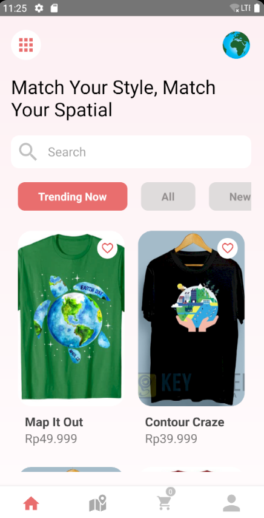
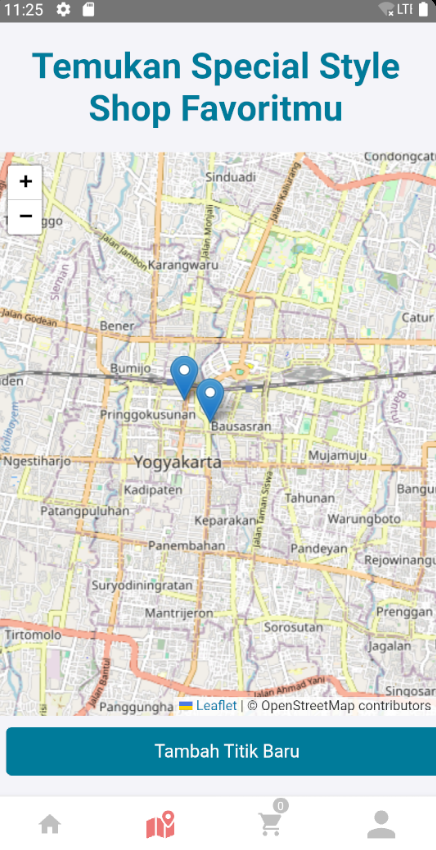
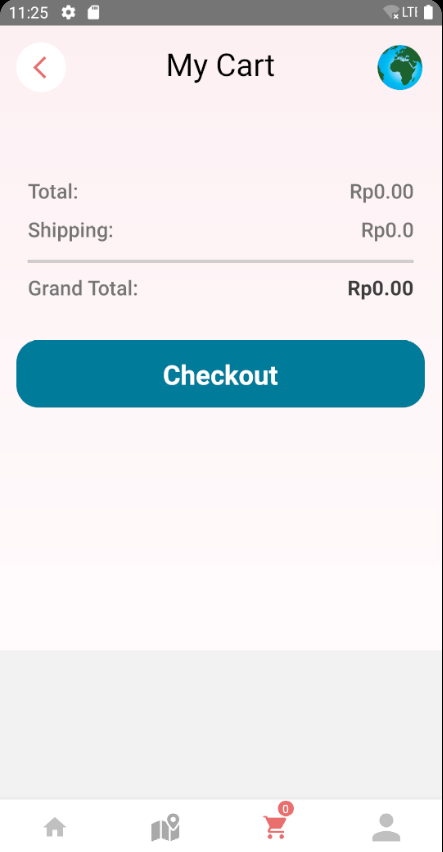
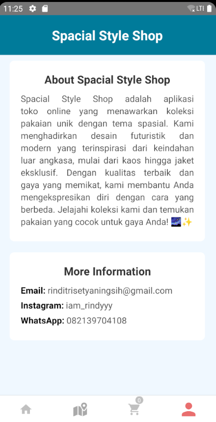

Special style Shop 

## Special style Shop
Aplikasi Spacial Style Shop ini merupakan sebuah aplikasi e-commerce dengan tema spatial dengan fitur-fitur yang dapat digunakan untuk explore produk yang ditawarkan, melakukan pembelian produk, dan tampilan map yang berfungsi untuk mengetahui lokasi cabang toko.  

## Komponen Pembangun
Beberapa komponen yang ditampilkan diambil dari React Native, JavaScript, HTML/CSS, Node.js/NPM, Android Studio, dan Visual Studio Code

## Manfaat dan Tujuan
Aplikasi Spacial Style Shop dibuat dengan tujuan untuk memberikan pengalaman belanja pakaian yang unik dan menarik dengan tema spasial. Melalui aplikasi ini, pengguna dapat dengan mudah menjelajahi koleksi, melakukan pembelian, dan menemukan produk yang sesuai dengan gaya mereka, sekaligus menciptakan platform yang memudahkan untuk menemukan tren mode yang berbeda dan inovatif.

## Sumber Data
1. Foto Katalog Baju diambil dari Google

### Link Project
[https://github.com/Rindi1414/Responsi_PGPBL]

### Tangkapan Layar

### Hak Cipta
Rindi Tri Setyaningsih

